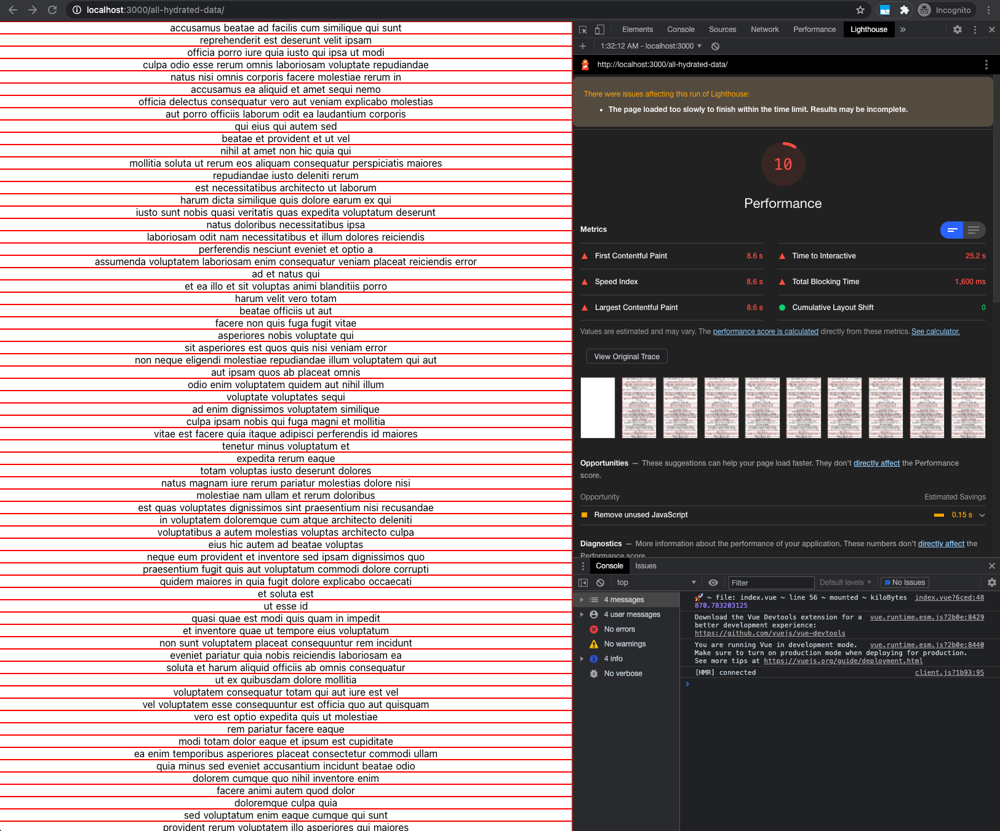
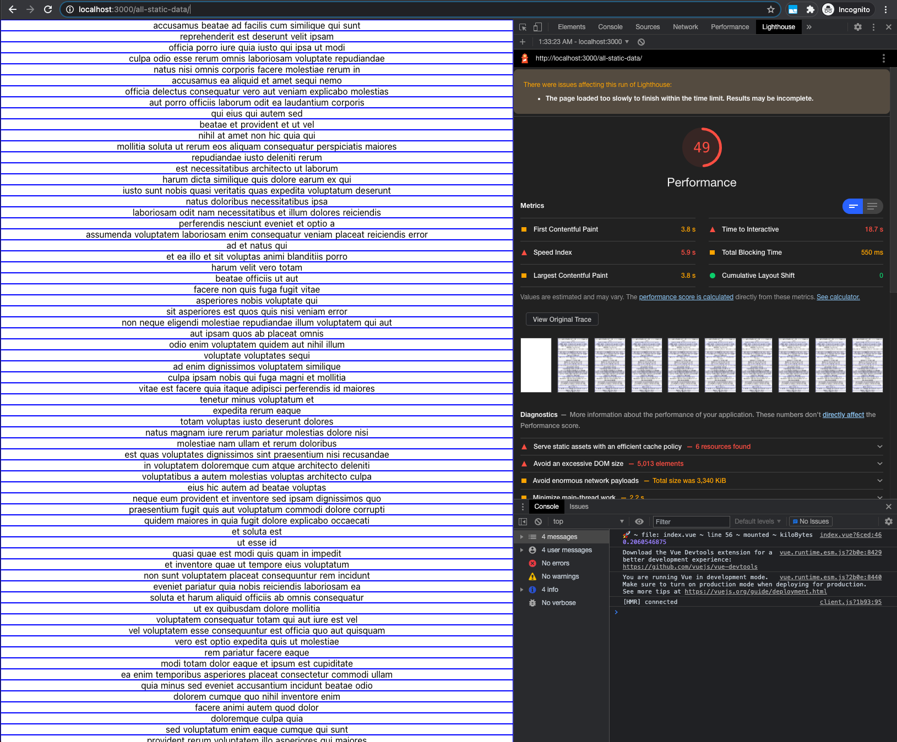
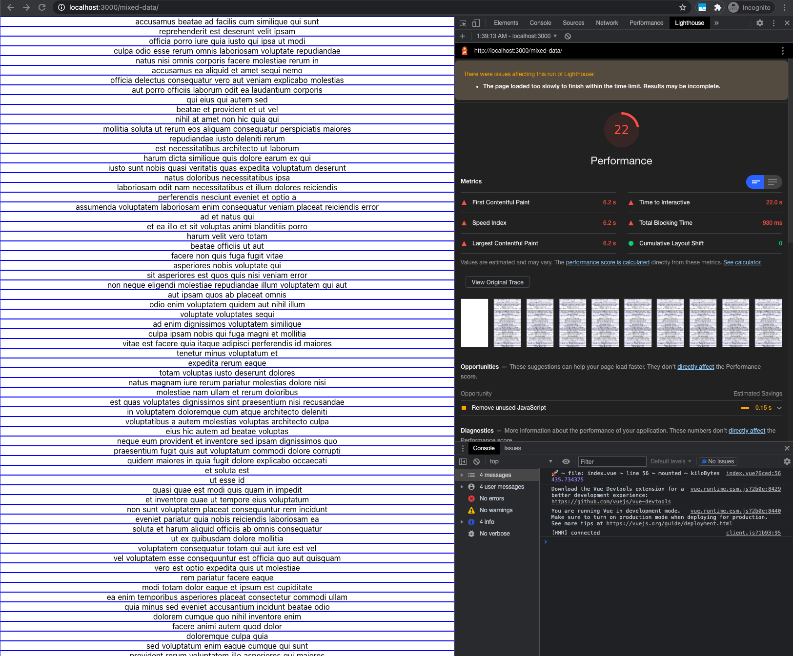

# testNuxt

The experiment contains 3 pages, each one renders 5000 items to the screen fetched on the server

* ## all-hydrated-data 
  * This is the basic example using `asyncData` that gets an object with 5000 items, renders it on the server and also returns the object in `__NUXT__` payload.
  
* ## all-static-data
  * Here the data is fetched again in `asyncData` but then moved to `$staticData` provided by [nuxt-static-render](https://github.com/galvez/nuxt-static-render). Hence, the data is rendered on the server and not passed to the client in `__NUXT__` payload.
  
* ## mixed-data
  * Here there is a mix of both options. All 5000 items are rendered on the server. 2500 items are rendered on the server using `$staticData`, and 2500 are also returned to the client in `__NUXT__` payload.
  * A small improvement were added here, as the hydration process happens only when the items are visible using [vue-lazy-hydration](https://www.npmjs.com/package/nuxt-lazy-hydration)
  


## Build Setup

```bash
# install dependencies
$ yarn install

# serve with hot reload at localhost:3000
$ yarn dev

# build for production and launch server
$ yarn build
$ yarn start

# generate static project
$ yarn generate
```

For detailed explanation on how things work, check out [Nuxt.js docs](https://nuxtjs.org).
